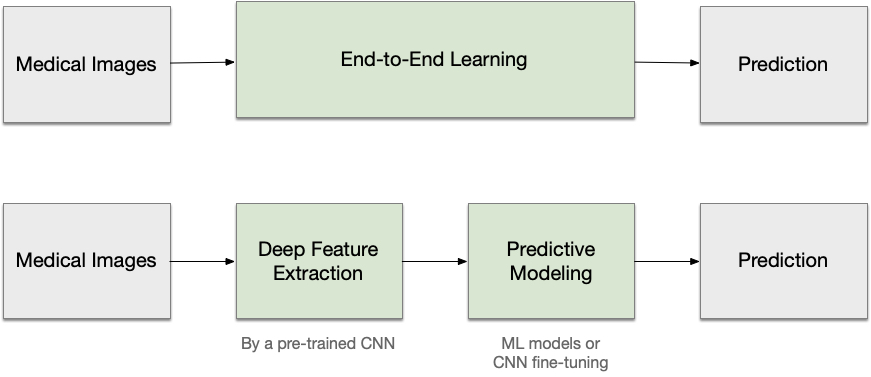
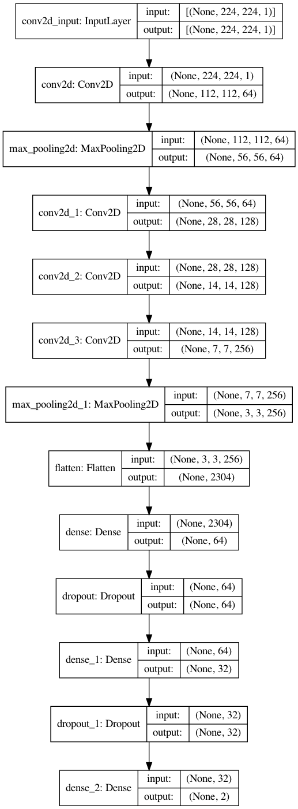
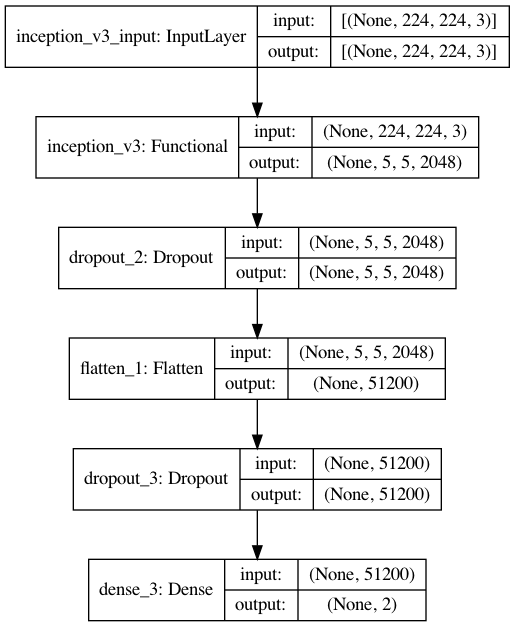
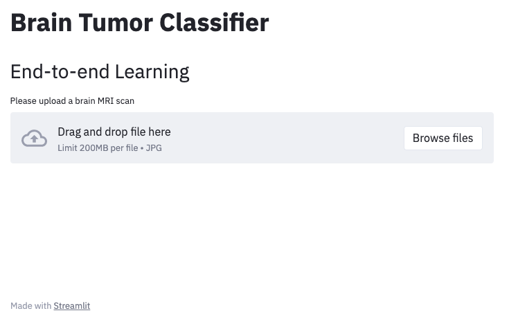
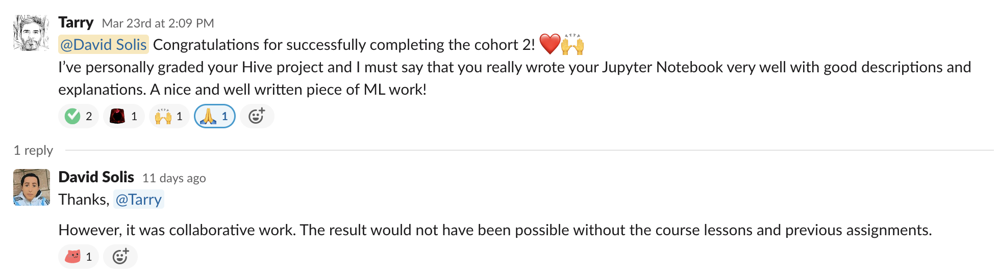

# Brain Tumor Classifier

Recently, deep learning has shown better performance over traditional machine learning approaches in various tasks,
for example, pattern recognition (i.e., object detection) and image segmentation. Deep learning is a particular
subfield of machine learning that employs artificial neural networks, allowing raw data processing directly. Indeed,
deep neural networks are becoming widespread in MRI analysis of the brain and are applied more in MRI than other
medical imaging types. For example, researchers use deep learning to preprocess and analyze MRI images
(applying deep feature extraction or end-to-end learning), including brain segmentation, noise reduction, registration, 
improved resolution, injury detection, and disease diagnosis. MRI analysis challenges, such as the [BraT
(Multimodal Brain Tumor Segmentation) challenge](https://www.med.upenn.edu/cbica/brats2020/) and the 
[TADPOLE (Longitudinal Evolution Prediction of Alzheimer’s Disease) challenge](https://tadpole.grand-challenge.org/), 
implemented some common deep learning approaches.

The purpose of this work is to implement two deep learning models for the detection of tumors in the human brain using 
public data sets of MRI scans. The first model consists of building a CNN from scratch (end-to-end learning), and the 
second is incorporating a pre-trained model with a technique called transfer learning. For this second case, we used 
the Inception v3 (the third edition of Google's Inception Convolutional Neural Network) model architecture and weights 
to train the model.

More specifically, the project comprises:
* Exploratory data analysis
* Image augmentation
* End-to-end learning (CNN from scratch)
* Transfer learning (Inception v3)
* Model Metrics
* Predictions

For more information, please review the [notebook](brain-tumor-classifier.ipynb).

## CNN Model

## Transfer Learning Model

## Web Application

Thanks to [Streamlit](https://streamlit.io/), a web application is available, where it is possible to test the 
classifier interactively.

The link to access the application is 
[Brain Tumor Classifier Demo](https://share.streamlit.io/david-solis/btc-demo/app.py).

## Course Feedback

